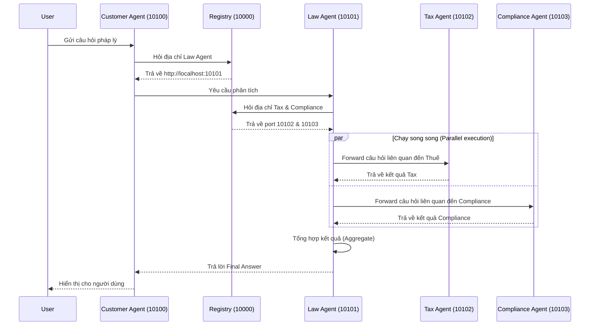

# Stage 5: Agent-to-Agent (A2A) Protocol - Request Flow

Dưới đây là Sequence Diagram minh họa luồng đi của một request trong hệ thống Multi-Agent phân tán (Stage 5):

```mermaid
sequenceDiagram
    participant User
    participant CustomerAgent as Customer Agent (10100)
    participant Registry as Registry (10000)
    participant LawAgent as Law Agent (10101)
    participant TaxAgent as Tax Agent (10102)
    participant CompAgent as Compliance Agent (10103)

    User->>CustomerAgent: Gửi câu hỏi pháp lý
    CustomerAgent->>Registry: Hỏi địa chỉ Law Agent
    Registry-->>CustomerAgent: Trả về http://localhost:10101
    CustomerAgent->>LawAgent: Yêu cầu phân tích
    LawAgent->>Registry: Hỏi địa chỉ Tax & Compliance
    Registry-->>LawAgent: Trả về port 10102 & 10103
    
    par Chạy song song (Parallel execution)
        LawAgent->>TaxAgent: Forward câu hỏi liên quan đến Thuế
        TaxAgent-->>LawAgent: Trả về kết quả Tax
    and 
        LawAgent->>CompAgent: Forward câu hỏi liên quan đến Compliance
        CompAgent-->>LawAgent: Trả về kết quả Compliance
    end
    
    LawAgent->>LawAgent: Tổng hợp kết quả (Aggregate)
    LawAgent-->>CustomerAgent: Trả lời Final Answer
    CustomerAgent-->>User: Hiển thị cho người dùng
```
